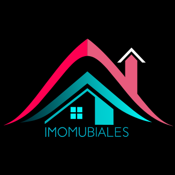

<div>
<!-- Banner del proyecto -->
  <div align='center'>
  <a href="https://github.com/No-Country/c16-61" target="_blank">
   
  </a>

  <br>
<h1>Bienvenidos a Imomubiales</h1></div>
<div>
  <p>
    <strong>Diseñamos una página web de E-Commerce para una pequeña empresa</strong>. Nuestra plataforma de E-Commerce inmobiliario ofrece un entorno exclusivo para la compra y exploración de propiedades. Digitaliza la experiencia inmobiliaria, permitiendo a los compradores interesados navegar, evaluar y expresar su interés en propiedades desde la comodidad de su hogar.
  </p>
    <div align='center'>
    <a href="https://imomubiales-bd6u7zh8y-deiviiss.vercel.app/"
     target="_blank">
          
       </a>
       <a href="https://www.figma.com/file/C1jlTxqhs8ido9jxXZv441/C16-41?type=design&node-id=0%3A1&mode=design&t=M5Rwsn7E48u5OGZO-1" target="_blank">
          
      </a>
      <a href="https://github.com/No-Country/c16-61/issues" 
      target="_blank">
          
      </a>
      </div>
</div>

<!-- Sobre el proyecto -->
<br>

# Acerca del Proyecto

Nuestra plataforma de eCommerce inmobiliario está diseñada exclusivamente para una empresa privada, facilitando un entorno único para la compra y exploración de propiedades. Este proyecto digitaliza la experiencia inmobiliaria, permitiendo a los compradores interesados navegar, evaluar y expresar su interés en propiedades desde la comodidad de su hogar.

- Landing Page: La puerta de entrada a nuestra selección de propiedades, donde destacamos las últimas ofertas, propiedades destacadas, y características únicas de nuestro catálogo, invitando a los usuarios a explorar más.

- Registro: Ofrecemos dos roles de registro: usuarios comunes, que buscan comprar o explorar propiedades, y el rol de propietario/inmobiliaria, reservado exclusivamente para la empresa privada, permitiéndole gestionar y publicar listados de propiedades.

- Publicar Propiedades: Como propietario/inmobiliaria, la empresa privada tiene la capacidad de listar nuevas propiedades, actualizar detalles, y presentar las ofertas más atractivas, manteniendo el catálogo fresco y atractivo.

- Ver y Filtrar Propiedades: Todos los usuarios, independientemente de su rol, pueden ver y aplicar filtros avanzados para encontrar propiedades que se ajusten a sus necesidades específicas, desde la ubicación hasta el precio y características especiales.


<br>

<!-- Colaboradores | Contribuidores -->

# Contribuidores

|  |  |  |  |  |
| :----------------------------------------------------------------------------------------------------------------------------------------------------------------------------------------------------------------------------------------------------------------------------------------------------------------------------------------------: | :-------------------------------------------------------------------------------------------------------------------------------------------------------------------------------------------------------------------------------------------------------------------------------------------------------------------------------------------------------------: | :-------------------------------------------------------------------------------------------------------------------------------------------------------------------------------------------------------------------------------------------------------------------------------------------------------------------------------------: | :-----------------------------------------------------------------------------------------------------------------------------------------------------------------------------------------------------------------------------------------------------------------------------------------------------------------------------------------: | :---------------------------------------------------------------------------------------------------------------------------------------------------------------------------------------------------------------------------------------------------------------------------------------------------------------------------------------------: |
| **Luca Pattin** <br><small>Full-Stack</small> | **Sebastian Carbonell** <br><small>Front-End</small> | **David Hilera** <br><small>Full-Stack</small> | **Stephany Acosta** <br><small>Front-End</small> | **David Manuel** <br><small>Front-End</small> |
| <a href="https://github.com/lupattin"></a> <a href="https://www.linkedin.com/in/luca-pattin-30b1136b/"></a> | <a href="https://github.com/Scarbonell11"></a> <a href="https://www.linkedin.com/in/sebastian-carbonell-frontenddev/"></a> | <a href="https://github.com/deiviiss"></a> <a href="https://www.linkedin.com/in/davidhilera/"></a> | <a href="https://github.com/snag2003"></a> <a href="https://www.linkedin.com/in/stephany-acosta/"></a> | <a href="https://github.com/davidmanueldev"></a> <a href="https://www.linkedin.com/in/davidmanuel01/"></a> |


<!-- Team Leader -->

# Team Leader

| |
|:-:|
| Verónica Molinari |
|<a href="https://www.linkedin.com/in/veronica-molinari/"></a> ||


<!-- Tech Stack -->

# Tecnologias Usadas

## Stack Front-End


[](https://git-scm.com/)


## Stack Backend


[](https://git-scm.com/)


## Base de datos


## Diseño


## Gestión y comunicación


<!-- Ejecutar el proyecto localmente -->

# Requisitos

Pasos para instalar el proyecto localmente:

1. Clonar el repositorio

   ```sh
   git clone https://github.com/No-Country/c16-61.git
   ```

2. Levantar la Base de datos (requiere tener Docker instalado)

   ```pwsh
   docker compose up -d
   ```

3. Configurar variables de entorno

   - Renombra el archivo `.env.example` a `.env`
   - Ingresa las variables de entorno

4. Instalar dependencias

   Ingresa a la carpeta:

   ```bash
   cd c16-61/
   ```

   Y ejecuta el comando:

   ```sh
   npm install
   ```

5. Ejecutar Prisma (ORM)

   ```sh
   npx prisma migrate dev
   ```

   ```sh
   npx prisma generate
   ```

6. Ejecutar el proyecto localmente

   ```sh
   npm run dev
   ```

7. Crear base de datos localmente [Click Aqui](http://localhost:3000/api/seed)

# Usuarios por defecto

<h3>Administrador:

<br>

`user:` admin@mail.com
`password:` admin123

</h3>
<h3>Usuario:

<br>

`user:` user1@mail.com
`password:` user01

</h3>
